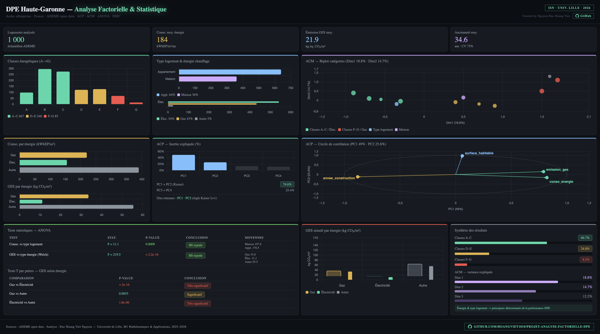

# Présentation du projet

L’étude porte sur la performance énergétique de **1000 logements individuels** construits entre **1900 et 2020** dans le département de la **Haute-Garonne**, pour lesquels un **DPE** a été réalisé avant **juillet 2021**.

Comme indiqué sur le portail open data de l’ADEME (<https://data.ademe.fr/datasets/dpe-31>), le diagnostic de performance énergétique (DPE) évalue la consommation d’énergie d’un logement ainsi que son impact en émissions de gaz à effet de serre. Il fournit également des informations sur les caractéristiques du bâtiment et ses équipements énergétiques.

L'objectif est de :

-   Comprendre les relations entre variables quantitatives et qualitatives

-   Identifier les corrélations entre consommation d’énergie et émissions de GES

-   Visualiser les profils de logements et l’impact du type de chauffage

-   Réaliser des tests statistiques (Chi-deux, ANOVA, t-tests)

# Organisation des codes
Deux versions de codes accompagnent ce projet :

-   un fichier **Python** dédié à la visualisation des données (*plots*)

-   un fichier **R** utilisé pour la réalisation des **tests statistiques**

# Structure du rapport
Le projet est divisé en plusieurs parties :

-   **Partie 1 :** Introduction

-   **Partie 2 :** Analyse descriptive

-   **Partie 3 :** Analyse en composantes principales ( ACP)

-   **Partie 4 :** Analyse des correspondances multiples (ACM)

-   **Partie 5 :** Test

-   **Partie 6 :** Conclusion

::: callout-note
## Consulter le rapport complet

Vous pouvez consulter le rapport détaillé du projet (format PDF) en cliquant sur le lien ci-dessous :

<a href="ProjetDPE.pdf" target="_blank" style="font-weight: bold; text-decoration: underline;"> Ouvrir le rapport PDF </a>
:::

::: callout-note
## Consulter le dashboard

:::
